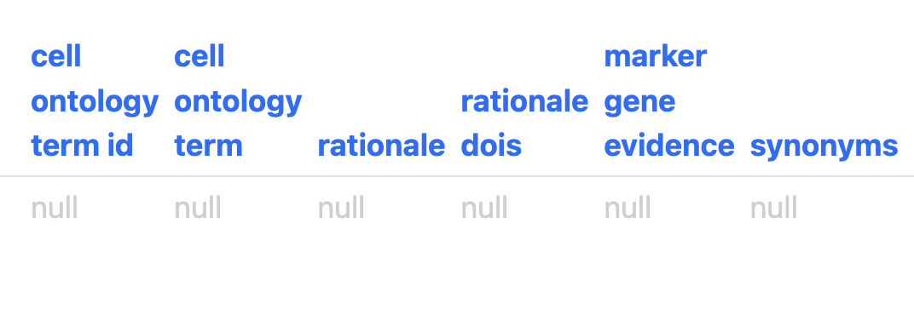

# Intro to Taxonomy Development Tools

## Background

Much cell type/class annotation consists simply of names attached to
individual cells in a cell-by-gene-matrix. Within the Brain Initiative,
it has become standard to extend this simple annotation by associating
it with additional information including: hierarchical relationships
between annotations; synonyms; annotation provenance (who annotated
what); supporting references; annotation transfer from other taxonomies;
marker genes; and cell type location, based on dissection and spatial
transcriptomics (e.g. MerFish).

Extended annotations have been published as standardized "taxonomies"
following the common cell type nomenclature standard [<u>(Miller et al.
2020)</u>](https://paperpile.com/c/od1Oz0/WFDT) and as unstandardised
supplementary material {add figure showing examples with refs}. These
are published separately from the cell-by-gene-matrices to which they
refer, with the only link between the two being the cell type/class name
used in annotation (sometimes supplemented by a file mapping cluster to
cell IDs). These links break easily (if names are changed) and without a
standard for versioning, taxonomies published in papers often do not
completely match cell-by-gene-matrices for the same paper published on
portals like CZ CELLxGENE. It is also difficult for the community to
make use of these taxonomy documents in combination with matrix files.

A typical workflow within BICAN starts from an agreed set of clusters.
Hierarchical annotations (taxonomies) are built on top of these clusters
by combining them to form a hierarchy of nested cell sets with a fixed
number of levels (see figure {hierarchical annotation}).

  
***Figure {hierarchical annotation}***: *Hierarchical annotation on an
Integrated Human Lung Cell Atlas. Panels **A** and **B** show annotation
at Levels 2 and 3 of the hierarchy. L2 annotation Airway epithelium
encompasses L3 annotations, Basal, secretory and Mucilated lineage.
**C** shows the nested relationship between cell sets in this
hierarchy - all cells in the Goblet cell set are in the secretory cell
set which are all in the Airway epithelium cell set etc. This can be
represented as a simple graph or tree as shown in Panel **D** - where
each cell set has only one parent.*

These extended annotations are typically developed using informally
structured spreadsheets, separate from the data being annotated in
cell-by-gene-matrices. This overcomes the typical limitations of
cell-by-gene-matrix formats like AnnData, which don't easily support
anything more than associating names with individual cells. In
spreadsheets, we can record annotations on a smaller number of sets of
cells (clusters and combinations of clusters), associating an annotation
with a rich context of additional information. Spreadsheets are easy to
share and edit, especially if developed on an online platform that can
reconcile concurrent edits (e.g. Google Sheets or Microsoft Sharepoint).
They can also easily be exported to and from CSV, supporting easy
conversion to DataFrames for programmatic population of content.

By convention these spreadsheets are structured with one row per
cluster. Additional columns record membership of the cluster higher
level cell sets and metadata about clusters (see figure
{informal_taxonomy})

  
***Figure: {Informal Taxonomy}*** *A fragment of an informal taxonomy
spreadsheet used to annotate a cell-by-gene-matrix of cells from the
basal ganglion. The first 2 columns contain the IDs and names of
clusters. The next three columns assign these clusters to progressively
larger cell set groupings: SubClass, Neighbourhood and Class. These
become the names of labelsets in CAS/TDT. The proceeding rows record
additional metadata about clusters including location based on
dissection, markers, cluster size etc. One disadvantage of this approach
is that there is no way to record additional metadata about cell sets
above the cluster level.*

This informal method is not without challenges. The connection between
these spreadsheets and matrices relies on cluster IDs or cell type/class
names. Researchers use *ad hoc* methods for synchronizing the two, often
involving an additional cluster- to-cell-ID mapping file. The structure
of the file also does not allow for adding metadata about cell sets
above the cluster level.

### Taxonomy Development Tools

We have developed an updated standard for representing taxonomies (Cell
Annotation Schema (CAS) {ref}), a graphical editor (Taxonomy Development
Tools (TDT)) and a system for publishing, versioning and sharing
taxonomies. Importantly, this system tightly integrates taxonomies with
cell-by-gene-matrices in AnnData (h5ad) format. The schema, which was
developed to support the broader community annotating cell-by-gene
matrices, contains a slot for linking to an AnnData file. TDT can use
this to check the associated AnnData file is in-sync with the taxonomy,
warning about any problems. It can also update the AnnData file when a
taxonomy changes. Another important feature is that this is an open
standard: it allows authors to define and edit any additional fields
that they need on top of the fields standards by CAS (figure).

TDT takes the typical informal taxonomy spreadsheets used within BICAN
as input, and with some minimal configuration, converts them into a CAS
compliant representation and checks this for consistency with a linked
AnnData file. Configuration includes specification of which columns
represent levels in the hierarchy and what level (or rank) they
represent. The name of each of these columns defines a set of
annotations called a labelset. Taxonomy_labelsets table in TDT supports
recording additional metadata about each labelset.

Annotations are represented in a taxonomy_annotations table with one row
per cell set (clusters and higher level groupings), allowing metadata to
be recorded for all levels . Each row has both CAS standard columns and
user-defined columns taken from the original spreadsheet (figure
{annotation_table C}) . The CAS standard supports taxonomy hierarchy via
specifying parent cell-set (figure {annotation_table A}). An
accompanying taxonomy tree view allows users to visualise this hierarchy
(figure {annotation_table D}). Other CAS columns include slots for cell
ontology terms mappings, synonyms, marker gene evidence, comments and
supporting references (figure {annotation_table B}). Editing support
includes pick-lists and autocomplete for fields including labelset,
parent cell set and cell ontology term. In future, CAS and TDT will
expand to include additional fields that are now only supported in user
defined fields.

A

  
B  

C  
  
D  
  
***Figure {annotation_table}***: ***A** Core CAS fields: accession (ID),
label, hierarchy. **B** Additional CAS fields allow linking to cell
ontology terms, recording marker gene evidence, synonyms, and
references. **C** User defined fields from the original spreadsheet
(shown in figure {Informal Taxonomy}. **D** Visualization of taxonomy
hierarchy as a tree.*

TDT uses GitHub to support concurrent editing by multiple users and to
control access. It does this in a way that insulates users from GitHub,
with a simple system for saving and publishing. All that is required of
users is that they register an account with GitHub and provide their
GitHub username, the email account they used to register and an access
token which they can request from GitHub. Saving automatically shares
edits with other editors. Publishing generates a named version that can
be shared via a simple URL. This allows for tracking of versions used in
analysis. The visibility of shared and published taxonomies is
controlled via access to the GitHub repo. During development of a
taxonomy, we limit this to a group of editors. Once the project is ready
to share with the world, the GitHub repo can be made public, allowing
anyone with the URL to access it.
